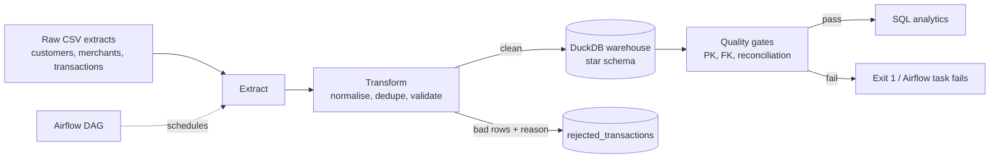

# Naira Payments ETL Pipeline


A production-style batch pipeline for a Nigerian payments/wallet business: it ingests messy transaction extracts, cleans and **quarantines** bad records, loads a **star schema**, and **blocks the run if data-quality gates fail**.

> Data is fully synthetic (seeded generator in `src/gen_data.py`) - no real customer data.

## Why this matters in fintech
Payments data is audited and reconciled. This project demonstrates the habits fintech data teams hire for:
- **Reconciliation** - `rows_in = loaded + rejected + duplicates`, checked on every run.
- **Quarantine, don't drop** - rejected rows keep a `reject_reason` for triage.
- **Fail loudly** - critical quality check failures exit non-zero (and fail the Airflow task).
- **Idempotent loads** and an audit table (`pipeline_runs`).

## Architecture


**Model:** `fact_transactions` with `dim_customer`, `dim_merchant`, `dim_date`; plus `rejected_transactions` and `pipeline_runs`. DDL in [`sql/schema.sql`](sql/schema.sql).

## Sample run (on injected dirty data)
```
transform: in=117891 clean=116137 rejected=1051 dupes=703
check row_reconciliation  PASS  (in=117891 loaded=116137 rejected=1051 dupes=703)
check fk_customer         PASS
check reject_rate_under_2pct PASS (reject rate 0.89%)
```
The generator deliberately injects duplicates, `' SUCCESS '`/`'Failed'` casing, null and negative amounts and orphan customer keys.

## Run it
```bash
pip install -r requirements.txt
python src/gen_data.py --out data/raw --dirty
PYTHONPATH=src python -m pipeline.run_pipeline --raw data/raw --db data/warehouse.duckdb   # PowerShell: $env:PYTHONPATH="src"
pytest -q
```
Then explore with [`sql/analytics_queries.sql`](sql/analytics_queries.sql) (window functions, channel failure rates, monthly volume).

## Stack
Python, pandas, DuckDB, SQL, pytest, GitHub Actions CI, Airflow (DAG in [`dags/`](dags/payments_etl_dag.py)).

## Honest scope / next steps
- The Airflow DAG is provided but not run in CI; locally the CLI is the entrypoint.
- Full-refresh load; next: incremental loads on `txn_timestamp` watermark, and Postgres/BigQuery targets.
- Next: Great Expectations / dbt tests (see my companion repo `fintech-dbt-analytics-warehouse`).
